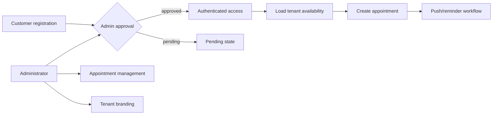
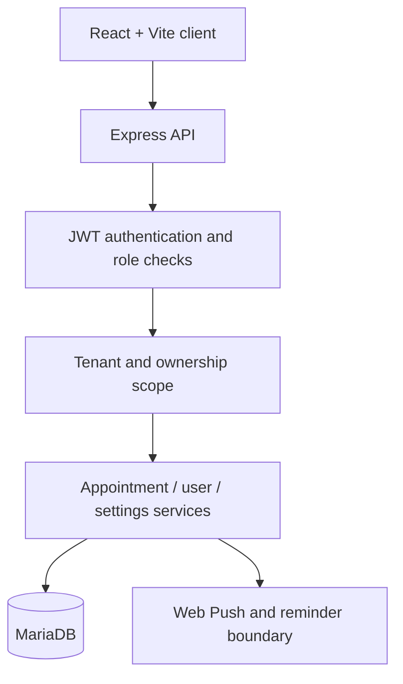
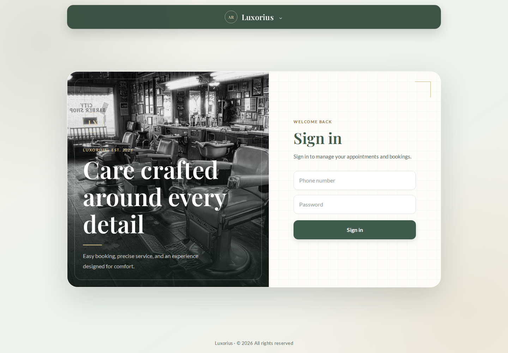
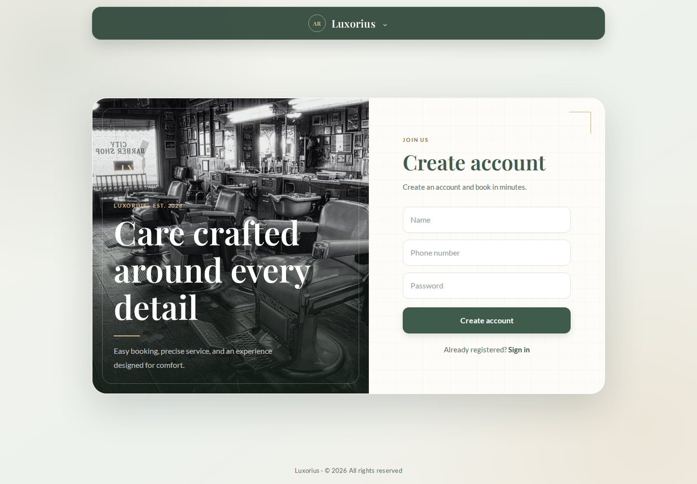
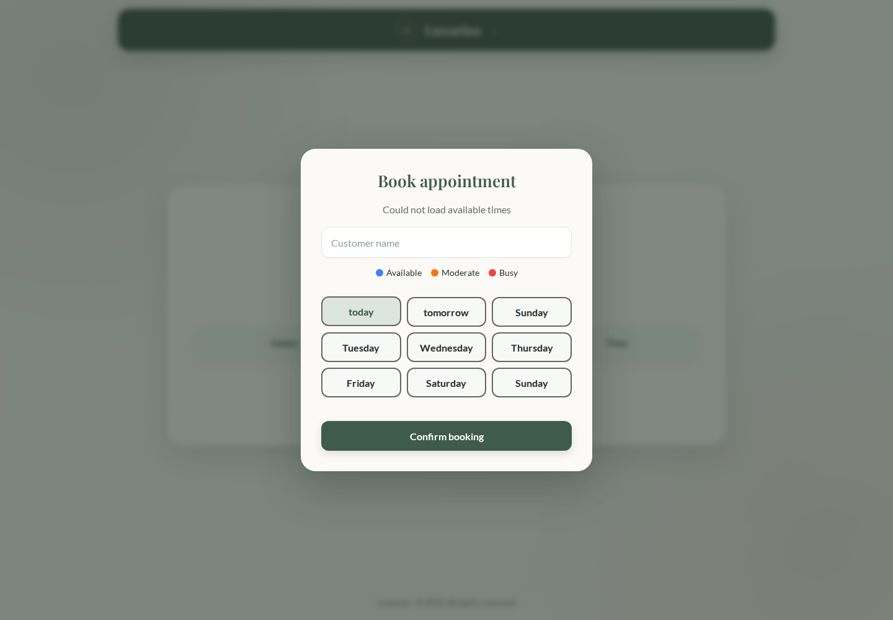
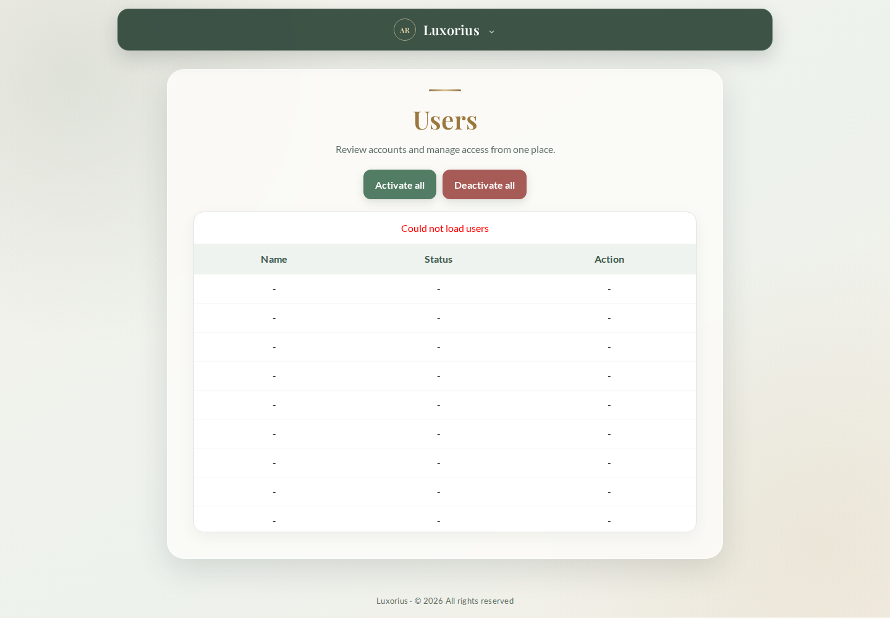
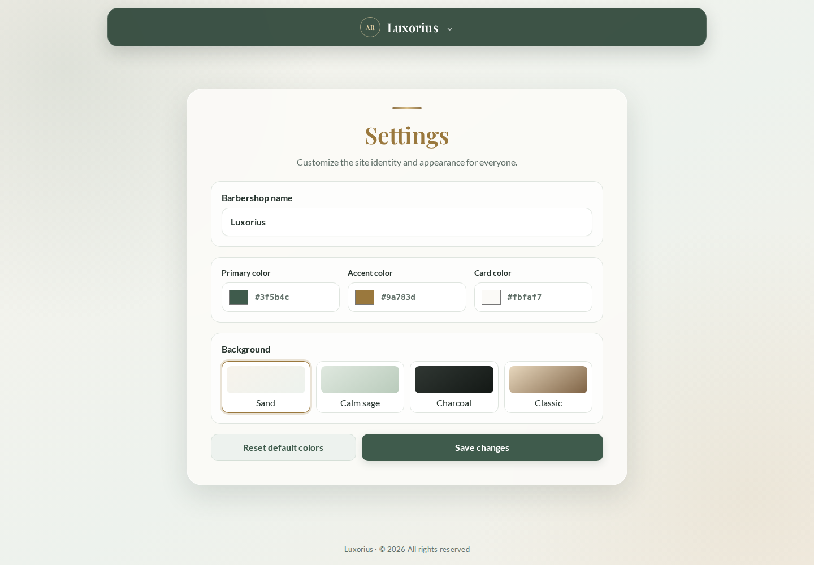

# Luxorius Appointment Platform

A multilingual, tenant-aware appointment and customer-management platform for service businesses.

   

## Overview

Luxorius provides customer registration, account approval, appointment scheduling, administrative user controls, notifications, progressive-web-app foundations, and tenant-specific branding. The system is designed so multiple service businesses can share an application runtime while keeping operational records scoped to the correct tenant.

The screenshots in this repository contain demonstration content only. Customer identity, production records, endpoints, and credentials are intentionally excluded.

## Problem

Appointment-based businesses need more than a calendar. They must control customer access, prevent conflicting bookings, communicate reminders, operate well on mobile devices, and adapt the experience to each business without mixing tenant data.

## Solution

Luxorius combines a responsive React client with an Express API and MariaDB data layer. Authentication establishes the tenant and role boundary, while server-side checks protect appointment, user, and settings operations. Tenant branding allows a shared platform to present a distinct identity for each business.

## Roles and Workflows

| Role | Capabilities |
|---|---|
| Guest | Register and sign in |
| Customer | View personal appointments, select available slots, create eligible bookings, cancel eligible bookings, and enable reminders |
| Administrator | Manage appointments, book for customers, review accounts, activate/deactivate users, and configure tenant branding |

## Key Features

- Customer registration and approval lifecycle
- Role-aware appointment and user administration
- Availability-oriented booking experience
- Tenant-scoped customer, appointment, and settings records
- Configurable business name, colors, surfaces, and backgrounds
- Browser push/PWA foundations and reminder workflows
- English, Arabic, and Hebrew interface support with RTL-aware presentation
- Responsive layouts for desktop and mobile use

## Architecture

See [Architecture](docs/ARCHITECTURE.md) for the trust and data boundaries.

## Multi-Tenant Design

The application uses a shared-schema tenant model. Business-owned records carry a tenant identifier. Public entry can select a tenant, but authenticated authorization relies on the tenant embedded in the verified token—not an untrusted browser parameter.

Tenant-aware uniqueness prevents the same business from duplicating a customer phone number or appointment slot while allowing separate businesses to use equivalent values independently.

## Technology Stack

- React 19, React Router, Vite, and Tailwind CSS
- Node.js and Express 5
- MariaDB through the MySQL-compatible driver
- JWT authentication and bcrypt password hashing
- Browser Web Push and scheduled reminder foundations
- Axios and schema/input validation utilities

## Screenshots

| Sign in | Registration |
|---|---|
|  |  |

| Appointments | Booking workflow |
|---|---|
|  |  |

| User administration | Tenant branding |
|---|---|
|  |  |

## Engineering Highlights

- Tenant scope is derived from verified authentication state for protected operations.
- Composite uniqueness protects tenant-local customer identities and appointment slots.
- Role-aware routes separate customer self-service from administrative operations.
- Branding is tenant data rather than a hard-coded deployment fork.
- Provider boundaries keep notifications and external communication separate from core booking rules.

## Security and Privacy

Passwords are hashed, authenticated API operations validate signed tokens, and role/tenant checks are enforced on the server. Public portfolio material contains no application source, database files, credentials, production URLs, customer identity, or customer records. See [Security](docs/SECURITY.md).

## Development Status

The current product demonstrates authentication, appointment, administration, notification, PWA, localization, and multi-tenant foundations. Production hardening priorities include conflict-safe scheduling under concurrency, dependable reminder delivery, integration testing, observability, and deployment validation.

## About This Repository

This is a portfolio showcase repository. The production source code is maintained privately. It contains reviewed documentation and sanitized demonstration screenshots—not a redistributable application implementation.

