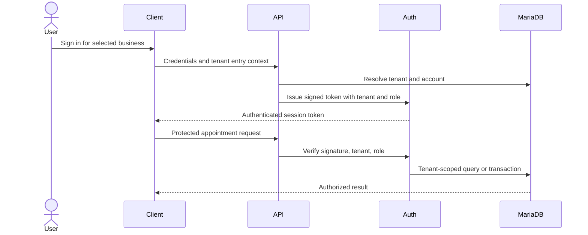

# Architecture

## Component boundaries

The React client owns presentation and interaction. The Express API authenticates requests, applies role and tenant guards, validates commands, and delegates to appointment, user, settings, and notification services. MariaDB is the operational data store.

## Tenant boundary

Browser-supplied tenant selection helps find the correct public entry point, but it does not authorize protected data access. Protected queries use verified authentication state.

## Data model overview

Tenants own customers, appointments, and visual settings. Customer identity and appointment-slot uniqueness are scoped within a tenant. This preserves a reusable shared runtime without allowing one business to address another business's records.

